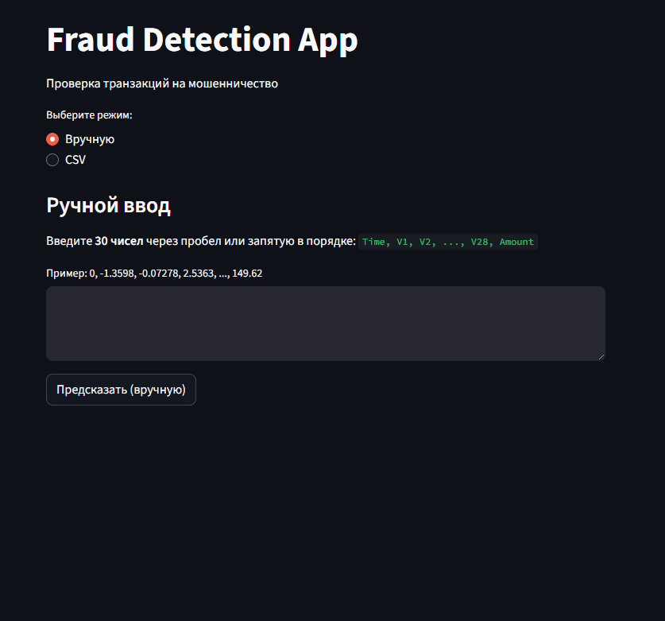

# Детектор мошеннических транзакций (Credit Card Fraud Detection)

Проект по выявлению мошеннических операций с кредитными картами. Содержит полный цикл работы: от анализа данных и обучения модели до создания веб-приложения на Streamlit для проверки транзакций.

---

## Демонстрация работы приложения
*(пример GIF-файла)*  


---

## Цели проекта
- Построить модель, которая определяет мошеннические транзакции.
- Учесть сильный дисбаланс классов в данных.
- Создать приложение для тестирования модели с вводом данных вручную или через CSV.

---

## Технологии

| Задача | Инструменты |
|--------|-------------|
| Анализ и моделирование | Python, Pandas, NumPy, Scikit-learn, XGBoost, imbalanced-learn (SMOTE), Joblib |
| Визуализация | Matplotlib, Seaborn |
| Веб-приложение | Streamlit |
| Данные | [Kaggle — Credit Card Fraud Detection Dataset](https://www.kaggle.com/datasets/mlg-ulb/creditcardfraud) |

---

## Этапы работы
1. **Исследование данных** — проверка распределения классов (492 мошеннических транзакции из ~285 тыс.).
2. **Подготовка данных**:
   - Масштабирование признаков `Time` и `Amount`.
   - Балансировка классов методом SMOTE.
3. **Обучение моделей**:
   - Logistic Regression
   - Random Forest
   - XGBoost (выбран как финальный вариант).
4. **Оценка по метрикам**: Accuracy, Precision, Recall, F1-score, ROC-AUC.
5. **Разработка приложения** на Streamlit.

---

## Результаты финальной модели (XGBoost)
| Метрика     | Значение |
|-------------|----------|
| Accuracy    | 0.99     |
| Precision   | 0.99     |
| Recall      | 0.99     |
| ROC-AUC     | ~1.0     |

---

## Структура проекта
```plaintext
fraud_detection_project/
│
├── .gitignore                      # Исключает ненужные файлы (например, venv)
├── app.py                          # Streamlit-приложение
├── fraud_detection_project.ipynb   # Ноутбук с анализом и обучением
├── fraud_detection_xgb.pkl         # Сохранённая модель
├── requirements.txt                # Список зависимостей для установки
├── run_app_fraud_det.bat           # bat-файл для быстрого запуска на Windows
├── test_transactions.csv           # Пример данных для тестирования
├── demo.gif                        # Демонстрация работы приложения
└── README.md                       # Этот файл

## Запуск проекта
# 1. Клонировать репозиторий
git clone https://github.com/rino78589/fraud_detection_project.git
cd fraud_detection_project

# 2. Создать и активировать виртуальное окружение
python -m venv venv
# Windows
venv\Scripts\activate
# macOS/Linux
source venv/bin/activate

# 3. Установить зависимости
pip install -r requirements.txt

# 4. Запустить приложение
streamlit run app.py
